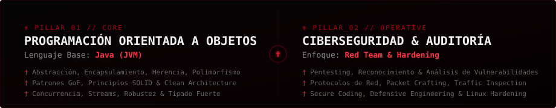

<div align="center">

  <!-- ✟ BANNER PRINCIPAL: GOTHIC EDGY 00x ✟ -->
  

  <br/><br/>

  <!-- ✟ TYPING EFFECT DINÁMICO ✟ -->
  <a href="https://github.com/0kmango">
    
  </a>

  <p align="center">
    <b>✟ 𝕹𝖀𝕷𝕷𝖀𝕸 𝕸𝕬𝕲𝕹𝖀𝕸 𝕴𝕹𝕲𝕰𝕹𝕴𝖀𝕸 𝕾𝕴𝕹𝕰 𝕸𝕴𝖃𝕿𝖀𝖁𝕬 𝕯𝕰𝕸𝕰𝕹𝕿𝕴𝕬𝕰 ✟</b>
  </p>

  

</div>

```text
       ✟ ───────────────────────────────────────────────────────────── ✟
           ██████╗  ██████╗ ██╗  ██╗
          ██╔═████╗██╔═████╗╚██╗██╔╝
          ██║██╔██║██║██╔██║ ╚███╔╝ 
          ████╔╝██║████╔╝██║ ██╔██╗ 
          ╚██████╔╝╚██████╔╝██╔╝ ██╗
           ╚═════╝  ╚═════╝ ╚═╝  ╚═╝
             ⸸  J A V A   O O P   //   S E C U R I T Y  ⸸
       ✟ ───────────────────────────────────────────────────────────── ✟
```

<div align="center">
  <p>
    <code>[ OPERATOR: 00x ]</code> • 
    <code>[ ALIAS: 0kmango ]</code> • 
    <code>[ BASE: JAVA POO ]</code> • 
    <code>[ DOMAIN: CYBERSECURITY ]</code> • 
    <code>[ STATUS: ACTIVE ]</code>
  </p>
</div>

<br/>

### ✟ ─── ❖ [ DOSSIER // MANIFIESTO DEL SISTEMA ] ❖ ─── ✟

> *"El código no es solo una secuencia de instrucciones, es una fortaleza construida en la oscuridad. Cada clase un bastión, cada interfaz un contrato inquebrantable, y cada byte auditado contra la intrusión."*

```ini
[CONFIDENTIAL // CLASSIFIED DOSSIER]
✟ CODENAME      : 00x
✟ IDENTITY      : 0kmango
✟ ARCHITECTURE  : Programación Orientada a Objetos (POO)
✟ CORE LANGUAGE : Java (JVM Ecosystem)
✟ SPECIALTY     : Ciberseguridad Ofensiva & Defensiva, Pentesting, Hardening
✟ ENVIRONMENT   : Linux (Kali Linux / Arch / Custom Unix Workstations)
✟ PHILOSOPHY    : Abstracción pura en la luz, explotación precisa en las sombras
```

<br/>

<div align="center">
  
</div>

### ✟ ─── ❖ [ PILARES TÉCNICOS & ARQUITECTURA ] ❖ ─── ✟

<div align="center">
  <!-- Tarjeta visual de Java OOP y Ciberseguridad -->
  
</div>

<br/>

#### ✟ 01. NÚCLEO: PROGRAMACIÓN ORIENTADA A OBJETOS (JAVA)
Mi base de ingeniería se fundamenta en el rigor de la **POO en Java**, diseñando software modular, escalable, tipado y resistente a fallos:
* **Principios Cardinales:** Encapsulamiento hermético, abstracción de modelos complejos, jerarquías de herencia limpias y polimorfismo dinámico.
* **Arquitectura de Software:** Principios **SOLID**, separación de responsabilidades y patrones de diseño GoF (*Factory, Singleton, Observer, Strategy, Decorator*).
* **Entorno JVM:** Gestión eficiente de memoria, manejo robusto de excepciones y concurrencia multihilo (*Threads, Concurrency Utilities*).

#### ✟ 02. DISCIPLINA: CIBERSEGURIDAD & ANÁLISIS OFENSIVO
Auditoría y fortificación de sistemas mediante una mentalidad de seguridad por diseño (*Security by Design*):
* **Auditoría & Pentesting:** Reconocimiento de superficies de ataque, análisis de vulnerabilidades y pruebas de penetración.
* **Seguridad de Redes:** Análisis de tráfico con Wireshark, inspección de paquetes, escaneo proactivo con Nmap y mapping de topologías.
* **Desarrollo Seguro:** Prevención de inyecciones, saneamiento estricto de buffers, criptografía aplicada y auditoría estática de código.

<br/>

<div align="center">
  
</div>

### ✟ ─── ❖ [ ARSENAL & HERRAMIENTAS // DARK STACK ] ❖ ─── ✟

<div align="center">

#### ✟ LENGUAJE NÚCLEO & ARQUITECTURA POO ✟
<p>
  
  
  
  
  
</p>

#### ✟ CIBERSEGURIDAD, HACKING ÉTICO & AUDITORÍA ✟
<p>
  
  
  
  
  
  
</p>

#### ✟ SISTEMAS, INFRAESTRUCTURA & AUTOMATIZACIÓN ✟
<p>
  
  
  
  
  
</p>

</div>

<br/>

<div align="center">
  
</div>

### ✟ ─── ❖ [ EL DEMONIO DEL SISTEMA // ZeroZeroX.java ] ❖ ─── ✟

```java
package root.shadows;

import security.defense.VulnerabilityScanner;
import architecture.oop.CleanArchitecture;

/**
 * ✟ 00x // Autonomous Sentinel Daemon ✟
 * Base: Object-Oriented Architecture & Security Analysis
 */
public final class ZeroZeroX extends Architect implements ExploitAuditor {

    private final String alias      = "00x";
    private final String operative  = "0kmango";
    private final String baseParadigm = "POO (Object-Oriented Programming)";
    private final String language   = "Java";
    private final String domain     = "Cybersecurity";

    public ZeroZeroX() {
        super(SecurityLevel.MAXIMUM);
        initializeSubsystems();
    }

    @Override
    public void executeLifeCycle() {
        while (isAlive()) {
            // ✟ POO: Fortalecer estructura y modularidad
            CleanArchitecture.enforceSOLIDPrinciples();
            
            // ✟ Ciberseguridad: Escaneo e inspección continua
            VulnerabilityScanner.auditNetworkPerimeter();
            
            // ✟ Resiliencia en las sombras
            sleepInDarkness(Interval.CONSTANT);
        }
    }

    public static void main(String... args) {
        System.out.println("✟ [00x] SYSTEM ONLINE: IN UMBRIS POTESTAS ✟");
        new ZeroZeroX().executeLifeCycle();
    }
}
```

<br/>

<div align="center">
  
</div>

### ✟ ─── ❖ [ TELEMETRÍA // GOTHIC RECON STATS ] ❖ ─── ✟

<div align="center">

  <table border="0">
    <tr>
      <td align="center">
        <!-- Tarjeta de Estadísticas de GitHub en tono negro y carmesí -->
        <a href="https://github.com/0kmango">
          
        </a>
      </td>
      <td align="center">
        <!-- Tarjeta de Lenguajes Principales -->
        <a href="https://github.com/0kmango">
          
        </a>
      </td>
    </tr>
  </table>

  <!-- Streak Stats en tono Dark / Gothic -->
  <p align="center">
    <a href="https://github.com/0kmango">
      
    </a>
  </p>

</div>

<br/>

<div align="center">
  
</div>

### ✟ ─── ❖ [ TRANSMISIÓN & CONTACTO // ROOT TERMINAL ] ❖ ─── ✟

<div align="center">

  <p>
    <i>« Las conexiones seguras no dejan rastro. Para comunicaciones directas o intercambio de llaves: »</i>
  </p>

  <p>
    <a href="https://github.com/0kmango">
      
    </a>
    <a href="mailto:contact@0kmango.dev">
      
    </a>
    <a href="https://github.com/0kmango">
      
    </a>
  </p>

  <br/>

  <p>
    <sub>✟ 00x // 0kmango • ALL RIGHTS RESERVED IN THE ABYSS • 2026 ✟</sub>
  </p>

  

</div>
